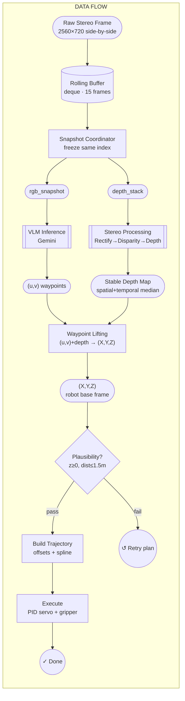

# VLA Robot

A hierarchical Vision-Language-Action (VLA) framework for robotic manipulation.
Takes a natural-language command and an RGB-D camera frame, then plans, projects, builds, and executes a smooth Cartesian trajectory on a 6-DOF arm — all in four stages.

---

## Pipeline Overview

```
RGB + Depth + Command
        │
        ▼
 Stage 1 ─ PlanStage       GeminiPlanner
                            (RGB + text) → semantic 2-D waypoints
        │
        ▼
 Stage 2 ─ ProjectStage    DepthProjector
                            (u, v) + depth → 3-D robot-frame Point3D
                            ↓ plausibility check (z≥0, dist≤1.5m)
                              retry planning once on failure
        │
        ▼
 Stage 3 ─ BuildStage      TrajectoryBuilder
                            geometric offsets + cubic spline → dense trajectory
        │
        ▼
 Stage 4 ─ ExecuteStage    CartesianPIDController + LeRobotInterface
                            closed-loop servo, gripper stepped at transitions
```

---

## Data Flow



---

## Requirements

- Python 3.10+
- UVC stereo camera (side-by-side, 2560×720) with stereo calibration YAML
- SO-101 6-DOF robot arm (via [LeRobot](https://github.com/huggingface/lerobot))
- Google Gemini API key

---

## Installation

```bash
git clone https://github.com/Haollll/vla_robot.git
cd vla_robot
```

```bash
conda create -n vla_robot python=3.10
conda activate vla_robot
pip install -r requirements.txt
```

`requirements.txt` installs everything:

```
numpy>=1.26
scipy>=1.13
Pillow>=10.0
opencv-contrib-python>=4.9
google-genai>=1.0
git+https://github.com/Kevinma0215/stereo-depth-toolkit.git
git+https://github.com/huggingface/lerobot.git
```

---

## Usage

### Dry run (plan + project + build — no robot required)

```bash
python main.py \
  --command "pick up the red cube and place it on the yellow paper" \
  --api-key $GEMINI_KEY \
  --dry-run
```

### Full run with live stereo camera

```bash
python main.py \
  --command "place the mug on the coaster" \
  --api-key $GEMINI_KEY \
  --calib  /path/to/calib.yaml \
  --port   /dev/ttyACM0
```

### Full run with pre-captured images

```bash
python main.py \
  --command "place the mug on the coaster" \
  --api-key $GEMINI_KEY \
  --rgb   /path/to/frame.png \
  --depth /path/to/depth.npy \
  --port  /dev/ttyACM0
```

> `--depth` accepts `.npy` (float32, metres) or `.png` (uint16, millimetres).
> Omit `--rgb` / `--depth` to use built-in synthetic demo data.

### Production mode (fail loudly on missing hardware)

```bash
python main.py \
  --command "pick up the red cube" \
  --api-key $GEMINI_KEY \
  --calib  /path/to/calib.yaml \
  --port   /dev/ttyACM0 \
  --no-mock
```

### CLI flags

| Flag | Default | Description |
|------|---------|-------------|
| `--command` / `-c` | `"Pick up the red cube..."` | Natural language task |
| `--api-key` / `-k` | *(required)* | Google Gemini API key |
| `--model` | `gemini-2.5-flash` | Gemini model ID |
| `--rgb` | None | Path to RGB image (PNG/JPEG) |
| `--depth` | None | Path to depth map (.npy metres or .png uint16 mm) |
| `--port` | `/dev/ttyACM0` | Robot serial port |
| `--calib` | None | Stereo calibration YAML (required for live camera) |
| `--uvc-width` | `2560` | UVC camera capture width |
| `--uvc-height` | `720` | UVC camera capture height |
| `--uvc-fps` | `30` | UVC camera frame rate |
| `--dry-run` | False | Skip robot execution (plan + project + build only) |
| `--no-mock` | False | Fail loudly if robot or lerobot is unavailable |
| `--log-level` | `INFO` | DEBUG / INFO / WARNING / ERROR |

---

## Configuration

All hardware parameters are in [vla_framework/config.py](vla_framework/config.py).
Hardware defaults (intrinsics, PID, offsets) are assembled by
[vla_framework/config_factory.py](vla_framework/config_factory.py).

### Camera intrinsics

```python
CameraIntrinsics(fx=615.3, fy=615.3, cx=320.0, cy=240.0, width=640, height=480)
```

Replace with values from your stereo calibration.

### Camera extrinsics (T_cam→robot)

Auto-loaded from `calibration/camera_to_robot.npy` if it exists (written by `calibrate.py`).
Falls back to a placeholder and prints a warning if the file is missing.

### Action offsets (metres)

| Action | Offset | Default |
|--------|--------|---------|
| APPROACH / MOVE / RETREAT | `safety_height` | 0.15 m |
| PRE_GRASP | `pre_grasp_height` | 0.05 m |
| GRASP | `grasp_descent` | 0.00 m |
| LIFT | `lift_height` | 0.20 m |
| PLACE | `place_height` | 0.02 m |

### Mock mode

`LeRobotInterface` silently falls back to mock mode if `lerobot` is not installed or the
serial port is unavailable. Use `--no-mock` to disable this:

```
WARNING  lerobot package not found — running in MOCK mode.
```

---

## Calibration

Eye-to-hand calibration maps the camera frame to the robot base frame.
Uses a **single ArUco marker** (DICT_4X4_50, ID 0, 40 mm) mounted on the end-effector.

See [calibration/README.md](calibration/README.md) for the full step-by-step workflow.

**Quick start:**

```bash
# 1. Generate the marker PDF
python calibrate.py --generate-marker

# 2. Run the interactive capture tool (follow 18 on-screen pose hints)
python calibrate.py \
  --calib /path/to/calib.yaml \
  --camera-matrix K.npy \
  --dist-coeffs dist.npy \
  --port /dev/ttyACM0

# 3. Press SPACE to capture each pose, ENTER when done
# → calibration/camera_to_robot.npy saved automatically
```

---

## Project Structure

```
vla_robot/
├── main.py                              Thin CLI: arg parsing, image loading, pipeline call
├── calibrate.py                         Interactive eye-to-hand calibration tool
├── requirements.txt
├── calibration/
│   ├── README.md                        Full calibration workflow
│   └── eye_to_hand_calibrator.py        ArUco-based calibration library
└── vla_framework/
    ├── config.py                        Hardware config dataclasses (VLAConfig, etc.)
    ├── config_factory.py                build_config() — assembles VLAConfig from CLI args
    ├── pipeline.py                      PlanStage, ProjectStage, BuildStage, ExecuteStage,
    │                                    VLAPipeline orchestrator
    ├── planner/
    │   └── gemini_planner.py            Stage 1: Gemini VLM → semantic waypoints
    ├── projection/
    │   └── depth_projection.py          Stage 2: pixel + depth → 3-D robot frame
    ├── path/
    │   └── trajectory_builder.py        Stage 3: offsets + cubic spline
    ├── camera/
    │   └── stereo_processor.py          Stereo-depth toolkit wrapper + live streamer
    └── control/
        ├── pid_controller.py            Stage 4: Cartesian PID controller
        └── lerobot_interface.py         Stage 4: SO-101 hardware bridge (+ mock mode)
```

---

## Action Types

| Type | Description |
|------|-------------|
| `APPROACH` | Move above target at safety height, gripper open |
| `PRE_GRASP` | Descend to just above object |
| `GRASP` | Close gripper at object centroid |
| `LIFT` | Raise grasped object to lift height |
| `MOVE` | Translate at safety height |
| `PLACE` | Lower object to destination surface, release gripper |
| `RETREAT` | Rise clear of workspace |
| `HOME` | Return to home pose |

---

## License

MIT
